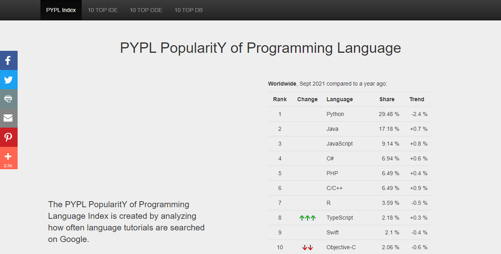

# C# 30 days of code

> Based on PYPL INDEX "PopularitY of Programming Language", C# is at the top 5 programming languages by September 2021.

C# is a very versatile programming language. Not only can you build Windows client applications, but you can also use C# to build Web and mobile apps. 

## Built With

- C#

## Live Demo

[Live Demo Link](https://www.hackerrank.com/domains/tutorials/30-days-of-code)

## Getting Started

Every full-stack developer should have skills for the front-end design, but to have dynamic apps you need the functionality that brings a back-end language like c#. To get started go to [Microsoft C# Official Documentatation](https://docs.microsoft.com/en-us/dotnet/csharp/tour-of-csharp/tutorials/)

## Authors (Github: Herokudev)
Herbert Orellana

- GitHub: [@herokudev](https://github.com/herokudev)
- LinkedIn: [LinkedIn](https://www.linkedin.com/in/herbert-armando-orellana-a0b50b34/)

## Show your support

Give a ⭐️ if you like this project!

## Acknowledgments

- The description of each challenge is part of the 30 days of code at [Hackerrank.com](https://www.hackerrank.com//)

## 📝 License

This project is [MIT](./MIT.md) licensed.
